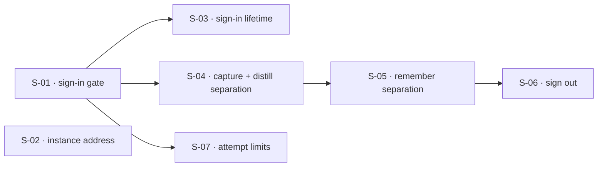

## At a glance

| ID | Outcome | Change ID | Status |
|----|---------|-----------|--------|
| S-01 | A person can register and sign in, and the instance refuses everyone who is not signed in | auth-flow-sign-in-gate | pending |
| S-02 | A person can point the TUI at an instance of their choosing | auth-flow-instance-address | pending |
| S-03 | A sign-in survives TUI restarts and expires after its validity period without silently losing work | auth-flow-sign-in-lifetime | pending |
| S-04 | Each person's captures, notes, and the cards distilled from them belong only to that person | auth-flow-capture-distill-separation | pending |
| S-05 | Each person's review sittings and schedule are their own, and no data crosses between people anywhere in the chain | auth-flow-remember-separation | pending |
| S-06 | A person can sign out and hand the TUI to another account without leaking the previous person's data | auth-flow-sign-out | pending |
| S-07 | Repeated sign-in and registration attempts from one source are limited | auth-flow-attempt-limits | pending |

## Dependencies

## Slices

### S-01: A person can register and sign in, and the instance refuses everyone who is not signed in

- **Outcome:** A person can register and sign in, and the instance refuses everyone who is not signed in
- **Acceptance criteria:** AC-03, AC-04, AC-05, AC-11, AC-12, AC-13
- **Change ID:** auth-flow-sign-in-gate
- **Status:** pending
- **Parallel with:** S-02

Every other slice needs a signed-in person, so identity and the gate come first. They land
together because a gate without sign-in only breaks the TUI and demonstrates nothing. The same
rules hold on localhost. This slice also carries FR-009, which has no story: rejecting a caller
who is not signed in consumes neither database nor LLM resources, while sign-in and
registration themselves are exempt. The slice runs on in-memory adapters; people, sign-ins, and
data ownership reach Postgres in one separate change that is not a slice of this roadmap.

### S-02: A person can point the TUI at an instance of their choosing

- **Outcome:** A person can point the TUI at an instance of their choosing
- **Acceptance criteria:** AC-01, AC-02
- **Change ID:** auth-flow-instance-address
- **Status:** pending
- **Parallel with:** S-01, S-03, S-04, S-05, S-06, S-07

Independent of identity: the published TUI works against a chosen address without code changes
or a rebuild, and switching replaces the previous instance. Whichever of S-01 and S-02 lands
second owns one interaction: a sign-in belongs to its instance, so switching instances never
sends the old instance's sign-in to the new one.

### S-03: A sign-in survives TUI restarts and expires after its validity period without silently losing work

- **Outcome:** A sign-in survives TUI restarts and expires after its validity period without silently losing work
- **Acceptance criteria:** AC-06, AC-07, AC-08
- **Change ID:** auth-flow-sign-in-lifetime
- **Status:** pending
- **Prerequisites:** S-01
- **Parallel with:** S-02, S-04, S-05, S-06, S-07

The exact validity period is PRD Open Question 1, resolved in this change's `/plan`. Expiry
during a capture conversation or a review sitting tells the person and lets them sign in
again; the PRD does not commit to the in-progress work surviving.

### S-04: Each person's captures, notes, and the cards distilled from them belong only to that person

- **Outcome:** Each person's captures, notes, and the cards distilled from them belong only to that person
- **Acceptance criteria:** AC-15
- **Change ID:** auth-flow-capture-distill-separation
- **Status:** pending
- **Prerequisites:** S-01
- **Parallel with:** S-02, S-03, S-07

Capture and distill are cut together because cards are generated in the background from a
person's notes, so ownership has to travel with the approval across the outbox. Until S-05
lands, remember still reads across people; that intermediate state is acceptable only because
the hosted instance stays off public addresses until FR-007 and FR-008 hold. Runs on in-memory
adapters; `db-adapter` proceeds in parallel, and ownership on Postgres arrives in the separate
change noted on S-01.

### S-05: Each person's review sittings and schedule are their own, and no data crosses between people anywhere in the chain

- **Outcome:** Each person's review sittings and schedule are their own, and no data crosses between people anywhere in the chain
- **Acceptance criteria:** AC-14, AC-16, AC-17
- **Change ID:** auth-flow-remember-separation
- **Status:** pending
- **Prerequisites:** S-04
- **Parallel with:** S-02, S-03, S-07

Remember follows capture and distill because its catalog and source lookup read distill's cards
and notes. This slice closes the whole chain, so it carries the chain-wide criteria: no read and
no change crosses between people at any stage. Runs on in-memory adapters, with Postgres
ownership in the separate change noted on S-01.

### S-06: A person can sign out and hand the TUI to another account without leaking the previous person's data

- **Outcome:** A person can sign out and hand the TUI to another account without leaking the previous person's data
- **Acceptance criteria:** AC-09, AC-10
- **Change ID:** auth-flow-sign-out
- **Status:** pending
- **Prerequisites:** S-05
- **Parallel with:** S-02, S-03, S-07

Waits on S-05 because "none of the previous person's data is visible" is only a meaningful check
once data is separated across the whole chain.

### S-07: Repeated sign-in and registration attempts from one source are limited

- **Outcome:** Repeated sign-in and registration attempts from one source are limited
- **Acceptance criteria:** AC-18, AC-19, AC-20
- **Change ID:** auth-flow-attempt-limits
- **Status:** pending
- **Prerequisites:** S-01
- **Parallel with:** S-02, S-03, S-04, S-05, S-06

Realizes the nice-to-have FR-010. The limit itself is PRD Open Question 2, resolved in this
change's `/plan`.

## Done
