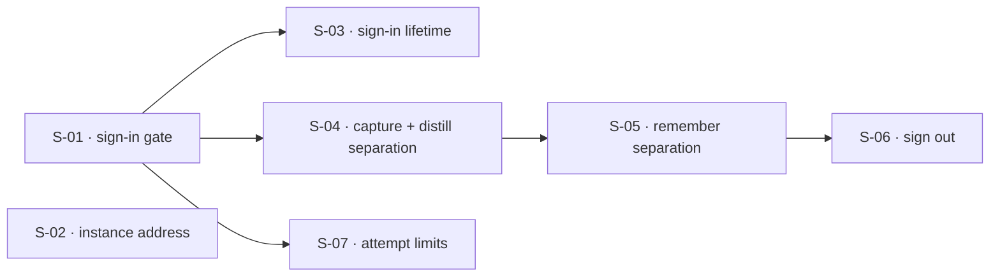

## At a glance

| ID | Outcome | Change ID | Status |
|----|---------|-----------|--------|
| S-01 | A person can register and sign in, and the instance refuses everyone who is not signed in | auth-flow-sign-in-gate | done |
| S-02 | A person can point the TUI at an instance of their choosing | auth-flow-instance-address | done |
| S-03 | A sign-in survives TUI restarts and expires after its validity period without silently losing work | auth-flow-sign-in-lifetime | done |
| S-04 | Each person's captures, notes, and the cards distilled from them belong only to that person | auth-flow-capture-distill-separation | done |
| S-05 | Each person's review sittings and schedule are their own, and no data crosses between people anywhere in the chain | auth-flow-remember-separation | in_progress |
| S-06 | A person can sign out and hand the TUI to another account without leaking the previous person's data | auth-flow-sign-out | pending |
| S-07 | Repeated sign-in and registration attempts from one source are limited | auth-flow-attempt-limits | in_progress |

## Dependencies

## Slices

### S-01: A person can register and sign in, and the instance refuses everyone who is not signed in

- **Outcome:** A person can register and sign in, and the instance refuses everyone who is not signed in
- **Acceptance criteria:** AC-03, AC-04, AC-05, AC-11, AC-12, AC-13
- **Change ID:** auth-flow-sign-in-gate
- **Status:** done
- **Parallel with:** S-02

Every other slice needs a signed-in person, so identity and the gate come first. The instance
gains registration, sign-in, and a gate that refuses everyone who is not signed in, with the
same rules on localhost. This slice also carries FR-009, which has no story: rejecting a caller
who is not signed in consumes neither database nor LLM resources, while sign-in and
registration themselves are exempt. A sign-in is accepted only by the instance that issued it;
that is the backend half of the interaction handed over by S-02. The TUI gains commands to
register and sign in, which confirm that the instance accepted the credentials, but it neither
keeps the sign-in nor sends it. Until S-03 lands, the instance therefore refuses the TUI's
capture, notes, and remember requests. That is accepted because S-03 follows directly and no
instance is deployed. Delivers both adapters for every port it touches: in-memory for tests and SQLAlchemy on Postgres, with its own Alembic revision where tables change. Work on this effort starts only after
`db-adapter` is complete, so the daemon already runs on Postgres.

### S-02: A person can point the TUI at an instance of their choosing

- **Outcome:** A person can point the TUI at an instance of their choosing
- **Acceptance criteria:** AC-01, AC-02
- **Change ID:** auth-flow-instance-address
- **Status:** done
- **Parallel with:** S-01, S-03, S-04, S-05, S-06, S-07

Independent of identity: the published TUI works against a chosen address without code changes
or a rebuild, and switching replaces the previous instance. Whichever of S-01 and S-02 lands
second owns one interaction: a sign-in belongs to its instance, so switching instances never
sends the old instance's sign-in to the new one.

### S-03: A sign-in survives TUI restarts and expires after its validity period without silently losing work

- **Outcome:** A sign-in survives TUI restarts and expires after its validity period without silently losing work
- **Acceptance criteria:** AC-06, AC-07, AC-08
- **Change ID:** auth-flow-sign-in-lifetime
- **Status:** done
- **Prerequisites:** S-01
- **Parallel with:** S-02, S-04, S-05, S-06, S-07

This slice makes the TUI usable again after S-01. The TUI keeps the sign-in across restarts,
sends it with every request, refuses to be used without one, and never sends one instance's
sign-in to another after an address switch (the TUI half of the interaction handed over by
S-02). S-01 already issues sign-ins that expire after a per-instance period, one day by
default. The final period is PRD Open Question 1, resolved in this change's `/plan`. Expiry
during a capture conversation or a review sitting tells the person and lets them sign in
again; the PRD does not commit to the in-progress work surviving. Delivers both adapters for every port it touches: in-memory for tests and SQLAlchemy on Postgres, with its own Alembic revision where tables change.

### S-04: Each person's captures, notes, and the cards distilled from them belong only to that person

- **Outcome:** Each person's captures, notes, and the cards distilled from them belong only to that person
- **Acceptance criteria:** AC-15
- **Change ID:** auth-flow-capture-distill-separation
- **Status:** done
- **Prerequisites:** S-01
- **Parallel with:** S-02, S-03, S-07

Capture and distill are cut together because cards are generated in the background from a
person's notes, so ownership has to travel with the approval across the outbox. Until S-05
lands, remember still reads across people; that intermediate state is acceptable only because
the hosted instance stays off public addresses until FR-007 and FR-008 hold. Delivers both adapters for every port it touches: in-memory for tests and SQLAlchemy on Postgres, with its own Alembic revision where tables change.

### S-05: Each person's review sittings and schedule are their own, and no data crosses between people anywhere in the chain

- **Outcome:** Each person's review sittings and schedule are their own, and no data crosses between people anywhere in the chain
- **Acceptance criteria:** AC-14, AC-16, AC-17
- **Change ID:** auth-flow-remember-separation
- **Status:** in_progress
- **Prerequisites:** S-04
- **Parallel with:** S-02, S-03, S-07

Remember follows capture and distill because its catalog and source lookup read distill's cards
and notes. This slice closes the whole chain, so it carries the chain-wide criteria: no read and
no change crosses between people at any stage. Delivers both adapters for every port it touches: in-memory for tests and SQLAlchemy on Postgres, with its own Alembic revision where tables change.

### S-06: A person can sign out and hand the TUI to another account without leaking the previous person's data

- **Outcome:** A person can sign out and hand the TUI to another account without leaking the previous person's data
- **Acceptance criteria:** AC-09, AC-10
- **Change ID:** auth-flow-sign-out
- **Status:** pending
- **Prerequisites:** S-05
- **Parallel with:** S-02, S-03, S-07

Waits on S-05 because "none of the previous person's data is visible" is only a meaningful check
once data is separated across the whole chain. Delivers both adapters for every port it touches: in-memory for tests and SQLAlchemy on Postgres, with its own Alembic revision where tables change.

### S-07: Repeated sign-in and registration attempts from one source are limited

- **Outcome:** Repeated sign-in and registration attempts from one source are limited
- **Acceptance criteria:** AC-18, AC-19, AC-20
- **Change ID:** auth-flow-attempt-limits
- **Status:** in_progress
- **Prerequisites:** S-01
- **Parallel with:** S-02, S-03, S-04, S-05, S-06

Realizes the nice-to-have FR-010. The limit itself is PRD Open Question 2, resolved in this
change's `/plan`. Delivers both adapters for every port it touches: in-memory for tests and SQLAlchemy on Postgres, with its own Alembic revision where tables change.

## Done

- **S-03: A sign-in survives TUI restarts and expires after its validity period without silently losing work** — Archived 2026-09-14 → `context/archive/changes/2026-09-14-auth-flow-sign-in-lifetime/`. Lesson: —.
- **S-02: A person can point the TUI at an instance of their choosing** — Archived 2026-09-13 → `context/archive/changes/2026-09-13-auth-flow-instance-address/`. Lesson: —.
- **S-01: A person can register and sign in, and the instance refuses everyone who is not signed in** — Archived 2026-09-14 → `context/archive/changes/2026-09-14-auth-flow-sign-in-gate/`. Lesson: —.
- **S-04: Each person's captures, notes, and the cards distilled from them belong only to that person** — Archived 2026-09-14 → `context/archive/changes/2026-09-14-auth-flow-capture-distill-separation/`. Lesson: —.
