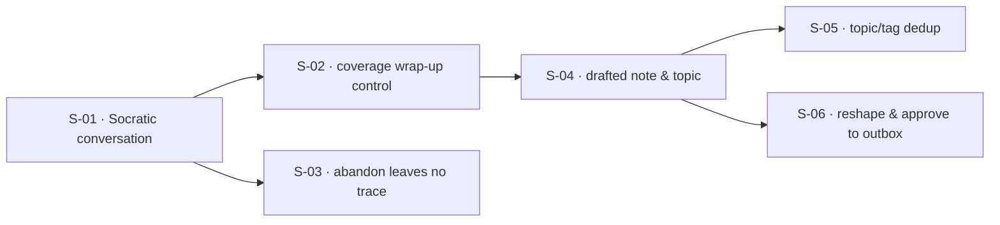

## At a glance

| ID | Outcome | Change ID | Status |
|----|---------|-----------|--------|
| S-01 | Users can talk through a topic and have the agent probe understanding gaps | capture-flow-socratic-conversation | done |
| S-02 | Users control when the conversation ends, even when the agent thinks it's done | capture-flow-coverage-wrapup | in_progress |
| S-03 | Users can abandon a capture session and leave no trace | capture-flow-abandon-session | pending |
| S-04 | Users receive a drafted note and topic synthesized from the conversation | capture-flow-draft-note | pending |
| S-05 | Users' topics and tags stay deduplicated through reuse | capture-flow-tag-dedup | pending |
| S-06 | Users can reshape and approve the draft before it reaches the outbox | capture-flow-review-approve-outbox | pending |

## Dependencies

## Slices

### S-01: Users can talk through a topic and have the agent probe understanding gaps

- **Outcome:** Users can talk through a topic and have the agent probe understanding gaps
- **Acceptance criteria:** AC-01, AC-02, AC-03, AC-04
- **Change ID:** capture-flow-socratic-conversation
- **Status:** done

### S-02: Users control when the conversation ends, even when the agent thinks it's done

- **Outcome:** Users control when the conversation ends, even when the agent thinks it's done
- **Acceptance criteria:** AC-05, AC-06
- **Change ID:** capture-flow-coverage-wrapup
- **Status:** in_progress
- **Prerequisites:** S-01
- **Parallel with:** S-03

### S-03: Users can abandon a capture session and leave no trace

- **Outcome:** Users can abandon a capture session and leave no trace
- **Acceptance criteria:** AC-07
- **Change ID:** capture-flow-abandon-session
- **Status:** pending
- **Prerequisites:** S-01
- **Parallel with:** S-02

### S-04: Users receive a drafted note and topic synthesized from the conversation

- **Outcome:** Users receive a drafted note and topic synthesized from the conversation
- **Acceptance criteria:** AC-08, AC-09
- **Change ID:** capture-flow-draft-note
- **Status:** pending
- **Prerequisites:** S-02

### S-05: Users' topics and tags stay deduplicated through reuse

- **Outcome:** Users' topics and tags stay deduplicated through reuse
- **Acceptance criteria:** AC-10, AC-11
- **Change ID:** capture-flow-tag-dedup
- **Status:** pending
- **Prerequisites:** S-04
- **Parallel with:** S-06

### S-06: Users can reshape and approve the draft before it reaches the outbox

- **Outcome:** Users can reshape and approve the draft before it reaches the outbox
- **Acceptance criteria:** AC-12, AC-13, AC-14, AC-15
- **Change ID:** capture-flow-review-approve-outbox
- **Status:** pending
- **Prerequisites:** S-04
- **Parallel with:** S-05

## Done

- **S-01: Users can talk through a topic and have the agent probe understanding gaps** — Archived 2026-08-31 → `context/archive/changes/2026-08-29-capture-flow-socratic-conversation/`. Lesson: —.
