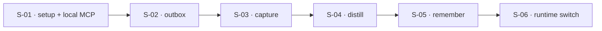

## At a glance

| ID | Outcome | Change ID | Status |
|----|---------|-----------|--------|
| S-01 | The author can query the local Postgres through an MCP server, with the database tooling ready to take its first revision | db-adapter-setup | pending |
| S-02 | Outbox envelopes persist in Postgres | db-adapter-outbox | pending |
| S-03 | Capture persists in Postgres and commits atomically with its envelopes | db-adapter-capture | pending |
| S-04 | Distill persists in Postgres and a capture approval becomes cards through the outbox | db-adapter-distill | pending |
| S-05 | Remember persists in Postgres and a card rejection discards the distill card through the outbox | db-adapter-remember | pending |
| S-06 | The daemon runs on Postgres and its state survives a restart | db-adapter-runtime-switch | pending |

## Dependencies

## Slices

### S-01: The author can query the local Postgres through an MCP server, with the database tooling ready to take its first revision

- **Outcome:** The author can query the local Postgres through an MCP server, with the database tooling ready to take its first revision
- **Acceptance criteria:** FR-09
- **Change ID:** db-adapter-setup
- **Status:** pending
- **Research:** sql-alchemy

This slice gives the rest of the effort a place to stand. A Postgres MCP server, configured
only for the local development database, lets the author inspect rows from an agent session.
The database tooling every later slice relies on is installed and runnable before any domain
table exists: an Alembic environment, the async engine and session source inside adapters, and
a real Postgres that tests can reach. It is demonstrable on its own: the MCP answers a query,
and an empty migration history upgrades cleanly.

### S-02: Outbox envelopes persist in Postgres

- **Outcome:** Outbox envelopes persist in Postgres
- **Acceptance criteria:** FR-01
- **Change ID:** db-adapter-outbox
- **Status:** pending
- **Prerequisites:** S-01
- **Research:** sql-alchemy

The shared envelope store comes first because all three modules append to it and the worker
claims from it. Its Postgres implementation carries an envelope's full state and arrives with
its own Alembic revision. It passes the same contract suites as the in-memory adapters, so
appending, claiming, acknowledging and failing behave identically. The daemon's runtime stays in
memory until S-06.

### S-03: Capture persists in Postgres and commits atomically with its envelopes

- **Outcome:** Capture persists in Postgres and commits atomically with its envelopes
- **Acceptance criteria:** FR-02, FR-07
- **Change ID:** db-adapter-capture
- **Status:** pending
- **Prerequisites:** S-02
- **Research:** sql-alchemy

Capture sessions, messages, notes, topics and tags get Postgres implementations behind their
existing ports, in capture's own Alembic revision. Capture is the first module whose commands
append envelopes, so it is where a command's state change and its outbox writes are first
proven to commit or roll back together. The frame parks one question for this change: how
concurrent turns on one session are handled.

### S-04: Distill persists in Postgres and a capture approval becomes cards through the outbox

- **Outcome:** Distill persists in Postgres and a capture approval becomes cards through the outbox
- **Acceptance criteria:** FR-03, FR-07, FR-08
- **Change ID:** db-adapter-distill
- **Status:** pending
- **Prerequisites:** S-03
- **Research:** sql-alchemy

Distill's notes and cards, including discards, persist in their own revision. Integration tests
on Postgres run the relay across modules:

- a capture note approval becomes a saved distill note;
- that saved note becomes its cards.

Distill never reads capture's stores. It depends on S-03 only because that relay starts at a
capture approval.

### S-05: Remember persists in Postgres and a card rejection discards the distill card through the outbox

- **Outcome:** Remember persists in Postgres and a card rejection discards the distill card through the outbox
- **Acceptance criteria:** FR-04, FR-07, FR-08
- **Change ID:** db-adapter-remember
- **Status:** pending
- **Prerequisites:** S-04
- **Research:** sql-alchemy

Sittings, review events and scheduling states persist in remember's own revision. Remember
comes last because its catalog and source locator read distill's cards and notes. On Postgres,
a card rejection travels through the outbox and discards the distill card. The frame parks one
question for this change: what remember's concurrency guarantees become once the in-process
lock is gone.

### S-06: The daemon runs on Postgres and its state survives a restart

- **Outcome:** The daemon runs on Postgres and its state survives a restart
- **Acceptance criteria:** FR-01, FR-02, FR-03, FR-04
- **Change ID:** db-adapter-runtime-switch
- **Status:** pending
- **Prerequisites:** S-05
- **Research:** sql-alchemy

The daemon's composition switches from the in-memory adapters to Postgres. The frame puts this
switch after all four surfaces are delivered, so no mixed runtime ever exists. Every surface's
state survives a daemon restart on the real running application, which confirms what S-02 to
S-05 proved in tests.

## Done
