# Research: Deploy Weles API on Mikrus with Neon Postgres, GHCR images, and local TUI

## Research Question

api - mikrus, znajdź informacje jak deployowac najlepiej z dockerem, dns, wszystko co potrzebuje
neodb - jako postgresql (najlepiej free tier, zobacz jak działa tam cold start), sprawdź czy neo ogarnia wektory
tui - to proste ale zepnij, github registry

(Follow-up in conversation: Mikrus pricing; whether docker-compose is needed with a single on-VPS service.)

## Summary

Run **one API container** on a paid **Mikrus 2.1+** VPS (Finlandia, **75–130 zł/rok** brutto), pull images from **GHCR** built by GitHub Actions, and point the app at **Neon** serverless Postgres over the internet (not “NeoDB” — likely **Neon** with default database name `neondb`). **pgvector** is supported on Neon. Use Mikrus **wykr.es / panel subdomains** for HTTPS at the edge (app serves plain HTTP). The **TUI** stays on the developer machine as an Ink CLI; wire it via a configurable API base URL (today hardcoded to localhost). **Plain `docker run` is enough for v1**; a **single-service `compose.yml`** in the repo is optional but improves repeatable deploys without adding real multi-service complexity.

## Findings

### Repository deployment surface

Weles has **no production Dockerfile**, **no `.github/workflows`**, and **no root `docker-compose`** for runtime. Development uses `.devcontainer/docker-compose.yml` with `postgres:16` and `DATABASE_URL` for the devcontainer only. The FastAPI app exposes **`GET /health`** and listens on port **8000** in local tooling. Application code still uses **in-memory adapters**; `DATABASE_URL` is required in settings but not yet wired to SQL adapters. **pgvector** is planned in ADRs, not in dependencies. The TUI is a **Node 22 Ink CLI**, not a web app; API client uses a fixed localhost base URL.

### Mikrus — Docker, DNS, HTTPS, constraints

Mikrus VPS are **LXC containers** in **Finlandia**, **1 Gbps**, annual billing ([mikr.us](https://mikr.us/)). **Docker** is supported on paid tiers from **2.1** upward; **1.0** is documented as without Docker. There is no dedicated wiki page for installing Docker Engine; FROG docs state Docker must be installed from a repository and the daemon started ([FROG FAQ](https://wiki.mikr.us/frog/faq/)). Use **`docker_proxy`** if Docker Hub rate limits bite ([N8N on Mikrus](https://wiki.mikr.us/n8n_na_mikrusie/)).

**Ports:** IPv4 uses forwarded ports (`20xxx`/`30xxx`); multiple containers should expose **one** public service and keep others on an internal Docker network ([IPv6 explainer](https://wiki.mikr.us/o_co_chodzi_z_ipv6/)). **No stable SWAP** in file on Mikrus ([technical limits](https://wiki.mikr.us/ograniczenia_techniczne_mikrusa/)).

**DNS / public URL (fast path):** `https://serwer-port.wykr.es` — TLS terminates at Mikrus; the application must speak **HTTP** to the edge ([shared domain](https://wiki.mikr.us/wspoldzielona_domena/)). Panel subdomains and `mikrus.cloud` / CLI `domena` often require listening on **IPv6** ([free subdomain](https://wiki.mikr.us/darmowa_subdomena_dla_vps/)). Own domain: **Cloudflare AAAA** + Flexible SSL, or **cloudflared** tunnel to `localhost:PORT` ([Cloudflare](https://wiki.mikr.us/podpiecie_domeny_przez_cloudflare/), [tunnel](https://wiki.mikr.us/podpiecie_domeny_przez_tunel_cloudflare/)).

**HTTPS:** On Mikrus free subdomains, **do not run Certbot** — SSL is automatic; app stays HTTP behind the edge ([subdomain doc](https://wiki.mikr.us/darmowa_subdomena_dla_vps/)). Optional **nginx** reverse proxy on the VPS if mapping :80/:443 to an internal port ([nginx RP](https://wiki.mikr.us/reverse_proxy_na_nginx/)).

**Ops:** Use `restart: unless-stopped` or systemd so the process survives SSH disconnect ([SSH disconnect wiki](https://wiki.mikr.us/program_przestaje_dzialac_gdy_zamykam_ssh/)). Prune images on small disks ([disk cleanup](https://wiki.mikr.us/sprzatanie_dysku/)). Behind a reverse proxy, run uvicorn/FastAPI with **`--proxy-headers`** ([FastAPI Docker deployment](https://fastapi.tiangolo.com/deployment/docker/)).

**Plan sizing for Python API + Docker:** FAQ suggests **Mikrus 2.1 (1 GB RAM)** minimum for Python stacks ([FAQ](https://wiki.mikr.us/faq_najczesciej_zadawane_pytania/)). **3.0 (2 GB)** is a comfortable buffer for Docker overhead, logs, and image layers.

### Mikrus — pricing (2026)

All listed VPS prices are **annual, gross (brutto), final** — not intro promos; renewal matches list price ([mikr.us](https://mikr.us/), [FAQ](https://wiki.mikr.us/faq_najczesciej_zadawane_pytania/)). No monthly billing.

| Plan | RAM | SSD | PLN / year | ~PLN / month | Notes |
|------|-----|-----|------------|--------------|--------|
| 1.0 | 384 MB | 5 GB | 35 | ~2.9 | No Docker |
| **2.1** | 1 GB | 10 GB | **75** | ~6.3 | Minimum for Docker API |
| **3.0** | 2 GB | 25 GB | **130** | ~10.8 | Recommended buffer |
| 3.5 | 4 GB | 40 GB | 197 | ~16.4 | AI / heavier workloads |
| 4.1 PRO | 8 GB | 80 GB | 395 | ~33 | 2× CPU / IOPS |
| 4.2 PRO | 16 GB | 160 GB | 790 | ~66 | Maximum tier |
| FROG | 256 MB | 3 GB | 0 | — | ~5 PLN activation; Alpine; tight for prod API |

**Extras:** Trial **Mikrus 2.1 for 30 days — 7 PLN**, no auto-renew ([mikr.us](https://mikr.us/)). Multi-year orders: **−15% (2y)** / **−17% (3y)** on product pages (e.g. [Mikrus 3.0](https://mikr.us/product/mikrus-3-0/)). Optional data disks: +35 / +70 / +140 / +280 PLN/year for 125 / 250 / 500 / 1000 GB.

**Stack cost sketch:** VPS **75–130 PLN/year** + **Neon free ($0)** + **GHCR** (typically $0) + **TUI hosting $0**; LLM/API keys are usage-based outside Mikrus.

### “neodb” → Neon (managed Postgres)

No public **neodb.dev** PostgreSQL hosting was found. **NeoDB** ([neodb.net](https://neodb.net/)) is a Fediverse app, not DBaaS. The intended product is almost certainly **Neon** ([neon.com](https://neon.com/)), whose connection strings often use database name **`neondb`**.

**Free tier:** $0/month; **100 compute-unit-hours/project/month**, **0.5 GB** storage, **5 GB** egress; exceeding limits **suspends compute until the next month** ([pricing](https://neon.com/pricing), [free FAQ](https://neon.com/faqs/free-plan-limits-and-quotas)). Scale-to-zero after **5 minutes** idle is **always on** on free and cannot be disabled.

**Cold start:** Reactivation typically **under 500 ms–1 s**; Postgres buffer cache is cold after wake ([scale to zero](https://neon.com/docs/introduction/scale-to-zero), [compute lifecycle](https://neon.com/docs/introduction/compute-lifecycle)). Projects idle **>7 days** may see slightly longer activation.

**Pooling:** Use hostname with **`-pooler`** and PgBouncer **transaction mode** for the API; use **direct** (non-pooler) for migrations and `pg_dump` ([connection pooling](https://neon.com/docs/connect/connection-pooling)).

**Postgres versions:** 14–18 at project creation ([compatibility](https://neon.com/docs/reference/compatibility)).

**Vectors:** **`pgvector` on all plans** — `CREATE EXTENSION IF NOT EXISTS vector;` ([pgvector](https://neon.com/docs/extensions/pgvector)).

**SSL:** Required; connection strings use `sslmode=require` ([connect securely](https://neon.com/docs/connect/connect-securely)). Pick **EU region** (e.g. `aws-eu-central-1`) near Finland-hosted API; region is **immutable** after project creation ([regions](https://neon.com/docs/introduction/regions)).

**Production caveats:** Free tier is not for production; expect cold starts and monthly caps; session state does not survive suspend; health-check pings can prevent scale-to-zero ([production checklist](https://neon.com/docs/get-started/production-checklist)).

### GitHub Container Registry and CI

Weles has **no workflows yet**. Publish with GitHub Actions: job `permissions: packages: write`, `docker/login-action` to `ghcr.io` with `GITHUB_TOKEN`, `docker/build-push-action` ([publish Docker images](https://docs.github.com/en/actions/tutorials/publish-packages/publish-docker-images)).

**Images:** `ghcr.io/<owner>/weles-api` (and optionally `weles-tui` CLI image). Tag with **`sha-<commit>`** for deploy pins; `latest` only on default branch if desired ([metadata-action](https://github.com/docker/metadata-action)).

**VPS pull:** Classic PAT with **`read:packages`** (+ `repo` if private); `docker login ghcr.io` ([GHCR](https://docs.github.com/en/packages/working-with-a-github-packages-registry/working-with-the-container-registry)). Deploy: pull pinned tag, replace container.

**TUI packaging:** Current TUI is **not** nginx-static; optional GHCR image for `docker run -it` with TTY. End users normally run **`pnpm build` / `weles`** locally with API URL pointing at the Mikrus HTTPS endpoint.

### End-to-end wiring

1. **CI** builds and pushes `weles-api` to GHCR on push to main (or release).
2. **Mikrus:** `docker login`, pull image, run API on panel port mapped to container **8000**, `--env-file` with `DATABASE_URL` (Neon pooler URL), secrets from `backend/.env.example` pattern.
3. **Mikrus panel:** assign subdomain → forwarded port; clients use **HTTPS** URL.
4. **TUI:** set base URL to that HTTPS origin (requires code/config change from hardcoded localhost).
5. **Database:** Neon only — no Postgres container on the VPS.

```mermaid
flowchart LR
  GHA[GitHub Actions] --> GHCR[ghcr.io/weles-api]
  GHCR --> Mikrus[Mikrus VPS]
  Mikrus --> API[FastAPI HTTP :8000]
  Neon[(Neon Postgres pgvector)] --> API
  Dev[TUI CLI local] -->|HTTPS| Edge[Mikrus SSL edge]
  Edge --> API
```

### Docker Compose vs plain Docker (single VPS service)

With **no co-located Postgres or TUI**, the runtime on Mikrus is **one API container**. **`docker run`** with `--restart unless-stopped`, `-p HOST_PORT:8000`, and `--env-file` is sufficient for v1.

A **single-service `docker-compose.yml`** (API only, `env_file`, ports, restart) adds no mandatory complexity but documents deploy as `docker compose pull && docker compose up -d` and eases later addition of nginx or `cloudflared` without rewriting deploy scripts. **Do not** add Postgres or TUI services to VPS compose for the target architecture.

## Code References

- `.devcontainer/docker-compose.yml:9-31` — dev-only `DATABASE_URL` and `postgres:16` healthcheck
- `.devcontainer/Dockerfile:1-16` — dev image, not production API image
- `backend/src/main.py:37-42` — HTTP routers; outbox route only when not prod
- `backend/src/adapters/http/health.py:6-8` — `GET /health` → `{"status": "ok"}`
- `backend/src/config/settings.py:30` — required `database_url` / `DATABASE_URL`
- `backend/pyproject.toml:10-12` — SQLAlchemy, asyncpg, Alembic (no pgvector package yet)
- `tui/package.json:5-15` — `weles` CLI bin, `tsup` build to `dist/`
- `tui/src/api/client.ts:27-29` — hardcoded `baseUrl: "http://localhost:8000"`
- `context/adrs/backend-stack/decision.md:25` — pgvector deferred until Postgres adapters (cited in prior exploration)
- `context/efforts/deployment/effort.md:1-12` — deployment effort shell, goal not yet filled

## External References

- https://mikr.us/ — VPS plans, annual brutto pricing, 7 PLN trial, Finlandia hosting
- https://wiki.mikr.us/faq_najczesciej_zadawane_pytania/ — brutto pricing, annual renewal equals purchase price
- https://wiki.mikr.us/frog/ — FROG limits, ~5 PLN activation, 256 MB RAM
- https://wiki.mikr.us/wspoldzielona_domena/ — wykr.es HTTPS at edge, app HTTP
- https://wiki.mikr.us/darmowa_subdomena_dla_vps/ — panel subdomains, no Certbot on Mikrus SSL
- https://wiki.mikr.us/o_co_chodzi_z_ipv6/ — one public container port pattern
- https://wiki.mikr.us/podpiecie_domeny_przez_cloudflare/ — own domain via AAAA + Flexible
- https://wiki.mikr.us/podpiecie_domeny_przez_tunel_cloudflare/ — cloudflared to localhost
- https://wiki.mikr.us/reverse_proxy_na_nginx/ — optional nginx on VPS
- https://wiki.mikr.us/n8n_na_mikrusie/ — `docker_proxy` for Hub limits
- https://fastapi.tiangolo.com/deployment/docker/ — proxy headers behind reverse proxy
- https://neon.com/pricing — Neon free limits and scale-to-zero on free
- https://neon.com/docs/extensions/pgvector — pgvector on all Neon plans
- https://neon.com/docs/introduction/scale-to-zero — 5 min idle, free cannot disable
- https://neon.com/docs/connect/connection-pooling — pooler hostname vs direct
- https://docs.github.com/en/actions/tutorials/publish-packages/publish-docker-images — GHCR from Actions
- https://docs.github.com/en/packages/working-with-a-github-packages-registry/working-with-the-container-registry — VPS `docker login` with PAT

## Open Questions

- Confirm **Neon** as the database vendor (vs another “neodb” product if a specific URL exists).
- **GHCR package visibility** (private vs public) and whether org SSO applies to deploy PAT.
- **Mikrus URL choice:** wykr.es port subdomain vs own domain + Cloudflare vs tunnel.
- **Neon tier:** free cold starts acceptable for capture/SSE, or paid Launch with scale-to-zero disabled.
- **Recommended VPS tier** for capture workload: 2.1 vs 3.0 under real memory profiling.
- **Implementation gaps:** production `backend/Dockerfile`, `.github/workflows/publish-images.yml`, TUI `WELES_API_URL` (or equivalent), SQL adapters + migrations before `DATABASE_URL` is meaningful in prod.
