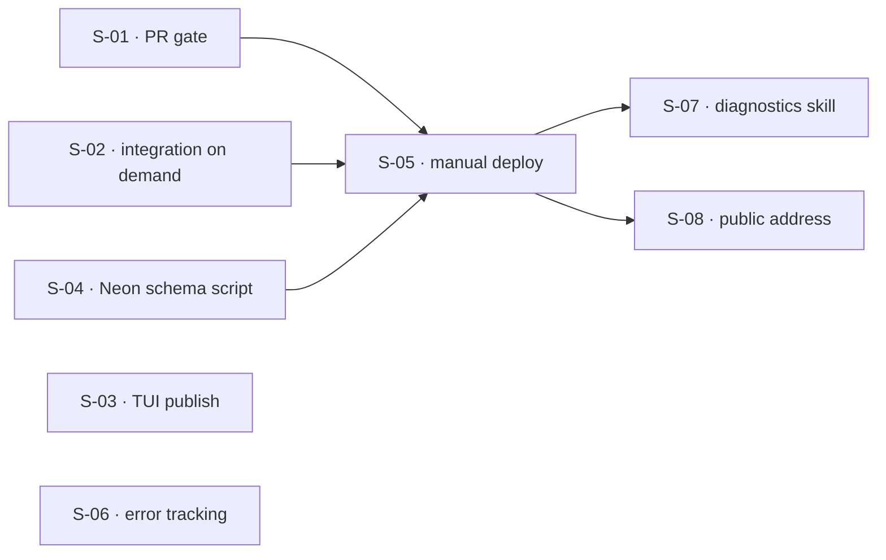

## At a glance

| ID | Outcome | Change ID | Status |
|----|---------|-----------|--------|
| S-01 | A change reaches main only through a pull request whose unit and BDD suites passed, with property hunts reported on it without blocking | deployment-pr-gate | in_progress |
| S-02 | The integration suite, Postgres lane included, runs in CI on demand for any commit | deployment-integration-on-demand | pending |
| S-03 | Anyone can install the published TUI without credentials | deployment-tui-publish | in_progress |
| S-04 | The author brings an empty or behind Neon database to a commit's schema with one script | deployment-neon-schema | in_progress |
| S-05 | The author deploys a chosen main commit to the Mikrus instance, and only a commit whose checks and integration run passed | deployment-manual-deploy | pending |
| S-06 | Unhandled errors reach error tracking without carrying anything people wrote | deployment-error-tracking | pending |
| S-07 | An agent skill diagnoses the hosted instance read-only and recommends next steps | deployment-diagnostics-skill | pending |
| S-08 | The author and the reviewer reach the hosted instance at a hard-to-discover public address | deployment-public-address | pending |

## Dependencies

## Slices

### S-01: A change reaches main only through a pull request whose unit and BDD suites passed, with property hunts reported on it without blocking

- **Outcome:** A change reaches main only through a pull request whose unit and BDD suites passed, with property hunts reported on it without blocking
- **Acceptance criteria:** FR-03, FR-04
- **Change ID:** deployment-pr-gate
- **Status:** in_progress
- **Parallel with:** S-02, S-03, S-04, S-06

The repository has no `.github/` and commits land directly on `main`, so today a check can
only report after the fact. This slice makes the check a gate. Every pull request runs the
backend and TUI unit suites and the BDD acceptance suite, whatever it touches, and `main`
accepts a change only when those checks pass. Property hunts run on the same pull request as
a separate job whose result is visible but never blocks a merge (FR-04 is folded in here
because it shares the trigger). Once this lands, work moves to branches. S-05's deploy gate
reads these checks.

### S-02: The integration suite, Postgres lane included, runs in CI on demand for any commit

- **Outcome:** The integration suite, Postgres lane included, runs in CI on demand for any commit
- **Acceptance criteria:** FR-05
- **Change ID:** deployment-integration-on-demand
- **Status:** pending
- **Parallel with:** S-01, S-03, S-04, S-06

Only the `-m postgres` lane exercises the SQL adapters that production runs on, and it needs
a `TEST_DATABASE_URL`. This slice lets a person trigger the integration suite for a chosen
commit in CI, with a Postgres service that provides `vector`. The suite never runs on its
own. S-05 accepts a commit only when a passing run exists for that same commit.

### S-03: Anyone can install the published TUI without credentials

- **Outcome:** Anyone can install the published TUI without credentials
- **Acceptance criteria:** FR-02
- **Change ID:** deployment-tui-publish
- **Status:** in_progress
- **Parallel with:** S-01, S-02, S-04, S-05, S-06, S-07, S-08

`tui/package.json` is `private` and unscoped, and the GitHub npm registry requires a token
even to install public packages, which rules it out (frame-log `tui-registry-auth`). Picking
the registry is a planning decision within that constraint. The TUI already points at an
instance of the person's choosing (auth-flow S-02), so a published build works against the
hosted instance with no rebuild.

### S-04: The author brings an empty or behind Neon database to a commit's schema with one script

- **Outcome:** The author brings an empty or behind Neon database to a commit's schema with one script
- **Acceptance criteria:** FR-08
- **Change ID:** deployment-neon-schema
- **Status:** in_progress
- **Parallel with:** S-01, S-02, S-03, S-06
- **Research:** pg-vector-support

Alembic revisions already live under `backend/src/adapters/out/sqlalchemy/migrations/`. The
app does not migrate on startup. This slice gives the author one supported script that brings
a Neon database, empty or behind, to the schema a given commit expects, `vector` extension
included, over the direct (non-pooler) connection. No data moves from a local database.
Running this script and deploying in the right order stays with the author (frame
out-of-scope, revisit before the next migration after this effort lands).

### S-05: The author deploys a chosen main commit to the Mikrus instance, and only a commit whose checks and integration run passed

- **Outcome:** The author deploys a chosen main commit to the Mikrus instance, and only a commit whose checks and integration run passed
- **Acceptance criteria:** FR-01, FR-06
- **Change ID:** deployment-manual-deploy
- **Status:** pending
- **Prerequisites:** S-01, S-02, S-04
- **Parallel with:** S-03, S-06
- **Research:** mikrus-cli

This is the tracer bullet for the production path: a deployable backend, run as a container
on the Mikrus VPS against Neon, replaced only when the author deliberately asks for a specific
`main` commit. Nothing changes on the instance merely because a commit lands on `main`. The
deploy refuses a commit unless S-01's blocking checks and an S-02 integration run passed for
that same commit. The instance needs S-04's schema to serve requests. The backend image
serves the author's instance only and is not published for others to run. This slice does
**not** open a public address: the hosted instance stays unreachable publicly until S-08. The
public repository, including deployment configuration, names no particular instance
(auth-flow FR-07).

### S-06: Unhandled errors reach error tracking without carrying anything people wrote

- **Outcome:** Unhandled errors reach error tracking without carrying anything people wrote
- **Acceptance criteria:** FR-07
- **Change ID:** deployment-error-tracking
- **Status:** pending
- **Parallel with:** S-01, S-02, S-03, S-04, S-05, S-07, S-08
- **Research:** observability

The backend today has Langfuse tracing for LLM and outbox paths, but nothing reports
unhandled errors. This slice reports unhandled errors from the API and the outbox worker to
error tracking, so the author does not have to watch the instance. Error reports and logs
never carry captures, notes, or cards. The slice is configured by environment, so it can be
demonstrated locally before S-05 and reaches the hosted instance whenever a deploy picks it
up. Picking the vendor happens in planning (Sentry was the initial pick). Structured
decision-path logging is out of scope.

### S-07: An agent skill diagnoses the hosted instance read-only and recommends next steps

- **Outcome:** An agent skill diagnoses the hosted instance read-only and recommends next steps
- **Acceptance criteria:** FR-09
- **Change ID:** deployment-diagnostics-skill
- **Status:** pending
- **Prerequisites:** S-05
- **Parallel with:** S-03, S-06, S-08
- **Research:** mikrus-cli, observability

The skill needs a running instance to reach, so it follows S-05. An agent skill reaches the
hosted instance, gathers what it needs to diagnose a failure, and reports the steps it
recommends to the author. It never restarts, redeploys, edits configuration, or touches data,
so it cannot bypass FR-01 or FR-06. The skill is committed to the public repository, so it
names no particular instance.

### S-08: The author and the reviewer reach the hosted instance at a hard-to-discover public address

- **Outcome:** The author and the reviewer reach the hosted instance at a hard-to-discover public address
- **Acceptance criteria:** frame boundary (inherited from auth-flow FR-01, FR-05)
- **Change ID:** deployment-public-address
- **Status:** pending
- **Prerequisites:** S-05
- **Parallel with:** S-03, S-06, S-07

This slice delivers the effort's outcome: the author and the certification reviewer use the
deployed instance through the TUI. It also has a gate outside this roadmap. The address goes
public only once auth-flow FR-01 and FR-05 hold, which are auth-flow S-01, S-04, and S-05 in
`context/efforts/auth-flow/roadmap.md`. Do not materialize this slice before those are
`done`. The address cannot be derived by enumerating a shared-domain pattern such as
`serwer-port.wykr.es`, and it does not surface in public certificate logs. Picking the
mechanism happens in planning, within that constraint. It reaches the reviewer only through
the private certification submission. Flooding protection stays deferred.

## Done
