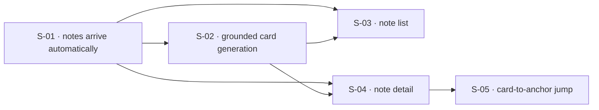

## At a glance

| ID | Outcome | Change ID | Status |
|----|---------|-----------|--------|
| S-01 | Users' approved notes arrive in Weles automatically | distill-flow-note-lands | done |
| S-02 | Weles generates grounded flashcards from a held note automatically, and zero cards is a valid outcome | distill-flow-grounded-generation | in_progress |
| S-03 | Users can see their notes — topic, distillation state, card count — without losing an in-flight capture session | distill-flow-note-list | pending |
| S-04 | Users can open a note and read what it produced | distill-flow-note-detail | pending |
| S-05 | Users can jump from a card to the passage it came from | distill-flow-card-anchor-jump | pending |

## Dependencies

## Slices

### S-01: Users' approved notes arrive in Weles automatically

- **Outcome:** Users' approved notes arrive in Weles automatically
- **Acceptance criteria:** AC-01, AC-02
- **Change ID:** distill-flow-note-lands
- **Status:** done

### S-02: Weles generates grounded flashcards from a held note automatically, and zero cards is a valid outcome

- **Outcome:** Weles generates grounded flashcards from a held note automatically, and zero cards is a valid outcome
- **Acceptance criteria:** AC-03, AC-04, AC-05, AC-06
- **Change ID:** distill-flow-grounded-generation
- **Status:** in_progress
- **Prerequisites:** S-01

### S-03: Users can see their notes — topic, distillation state, card count — without losing an in-flight capture session

- **Outcome:** Users can see their notes — topic, distillation state, card count — without losing an in-flight capture session
- **Acceptance criteria:** AC-07, AC-08, AC-09, AC-10
- **Change ID:** distill-flow-note-list
- **Status:** pending
- **Prerequisites:** S-01, S-02
- **Parallel with:** S-04

### S-04: Users can open a note and read what it produced

- **Outcome:** Users can open a note and read what it produced
- **Acceptance criteria:** AC-11, AC-12
- **Change ID:** distill-flow-note-detail
- **Status:** pending
- **Prerequisites:** S-01, S-02
- **Parallel with:** S-03

### S-05: Users can jump from a card to the passage it came from

- **Outcome:** Users can jump from a card to the passage it came from
- **Acceptance criteria:** AC-13
- **Change ID:** distill-flow-card-anchor-jump
- **Status:** pending
- **Prerequisites:** S-04

## Done

- **S-01: Users' approved notes arrive in Weles automatically** — Archived 2026-09-04 → `context/archive/changes/2026-09-03-distill-flow-note-lands/`. Lesson: —.
