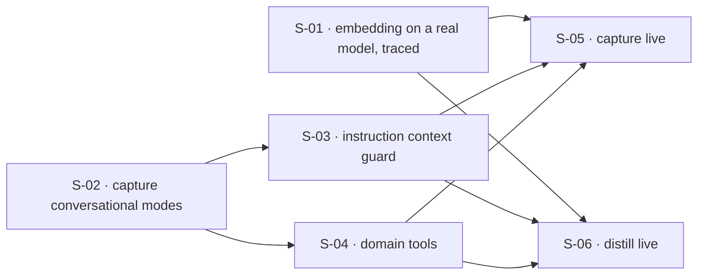

## At a glance

| ID | Outcome | Change ID | Status |
|----|---------|-----------|--------|
| S-01 | Vocabulary reuse runs on a real embedding model, traced in Langfuse | llm-adapter-embedding-tracer | done |
| S-02 | A capture session moves between conversing and note drafting on the user's word | llm-adapter-capture-modes | done |
| S-03 | Capture's instructions are domain artifacts that cannot dispatch without their context | llm-adapter-instruction-context | done |
| S-04 | The model reaches the domain only through tools that never mutate an aggregate | llm-adapter-domain-tools | done |
| S-05 | Capture converses end to end against a real provider | llm-adapter-capture-live | done |
| S-06 | Distill generates cards end to end against a real provider | llm-adapter-distill-live | done |

## Dependencies

## Slices

### S-01: Vocabulary reuse runs on a real embedding model, traced in Langfuse

- **Outcome:** Vocabulary reuse runs on a real embedding model, traced in Langfuse
- **Acceptance criteria:** FR-08
- **Change ID:** llm-adapter-embedding-tracer
- **Status:** done
- **Parallel with:** S-02
- **Research:** current-context, pydantic-ai, langfuse

`EmbeddingPort` is the one seam in the port inventory with no policy surface, so it proves
the outbound LLM seam end to end at the lowest cost: the `adapters/out/llm/` package, the
provider extras and settings, and Langfuse tracing all land here and every later slice
inherits them. Observability is deliberately first — the adapters are built with traces
visible from their first model call, not instrumented afterwards. `VocabularyResolver`'s
reuse-or-mint runs against real embeddings and the existing embedding contract suite passes
against the new adapter without changing the port signature.

### S-02: A capture session moves between conversing and note drafting on the user's word

- **Outcome:** A capture session moves between conversing and note drafting on the user's word
- **Acceptance criteria:** FR-01, FR-02, FR-03, FR-04
- **Change ID:** llm-adapter-capture-modes
- **Status:** done
- **Parallel with:** S-01
- **Research:** current-context

The effort's thesis made falsifiable with no model in the loop. Phases and the legal moves
between them become domain artifacts — abstractions in `domain/shared/`, the concrete
capture graph in `domain/capture/` — and the deterministic in-memory adapters drive off that
graph rather than holding a mode machine of their own. The transition into note drafting
rests with the user in both directions and neither is terminal while the session is open;
assessed coverage feeds what the agent says and when it encourages a move, rather than
riding along as telemetry. No agent concept is introduced: modelling phases and transitions
alone is what keeps a later handoff design possible.

### S-03: Capture's instructions are domain artifacts that cannot dispatch without their context

- **Outcome:** Capture's instructions are domain artifacts that cannot dispatch without their context
- **Acceptance criteria:** FR-05
- **Change ID:** llm-adapter-instruction-context
- **Status:** done
- **Prerequisites:** S-02
- **Parallel with:** S-04
- **Research:** current-context

Instructions for capture's model-facing tasks move into the domain, each declaring the
context it requires to do its job. The declaration is per-adapter-task and enforced as a
deterministic guard, so an instruction dispatched with incomplete context fails rather than
reaching a model. The in-memory adapters render these instructions instead of carrying
their own text, which is what keeps them thin. Exercisable by ordinary unit tests with no
model and no adapter in the loop.

### S-04: The model reaches the domain only through tools that never mutate an aggregate

- **Outcome:** The model reaches the domain only through tools that never mutate an aggregate
- **Acceptance criteria:** FR-06, FR-07
- **Change ID:** llm-adapter-domain-tools
- **Status:** done
- **Prerequisites:** S-02
- **Parallel with:** S-03
- **Research:** current-context

Tool definitions become domain artifacts whose names, arguments, and results read as domain
concepts, invoking domain functions, services, or ports rather than adapter helpers. Tools
read and compute; they never mutate an aggregate. A model's request to change state arrives
as a declared intent, and the aggregate mutation stays with the application command, gated
by the legal transitions S-02 put in the domain. Depends on S-02 for that gate but not on
S-03 — tools and instructions attach to the same phase surface independently.

### S-05: Capture converses end to end against a real provider

- **Outcome:** Capture converses end to end against a real provider
- **Acceptance criteria:** FR-08, FR-09
- **Change ID:** llm-adapter-capture-live
- **Status:** done
- **Prerequisites:** S-01, S-03, S-04
- **Parallel with:** S-06
- **Research:** current-context, pydantic-ai, langfuse

`adapters/out/llm/capture/` renders the domain policy against a real provider for topic
extraction, confidence assessment, and streaming reply generation, reusing the provider and
tracing wiring from S-01. Verified by the author's own manual use of a full capture session,
with every model interaction visible as a Langfuse trace. The framework-neutrality claim is
tested here for the first time: the adapter holds all prompt assembly, provider protocol,
tool registration, and structured-output decoding, and nothing under `domain/` knows
pydantic-ai exists.

### S-06: Distill generates cards end to end against a real provider

- **Outcome:** Distill generates cards end to end against a real provider
- **Acceptance criteria:** FR-08, FR-09
- **Change ID:** llm-adapter-distill-live
- **Status:** done
- **Prerequisites:** S-01, S-03, S-04
- **Parallel with:** S-05
- **Research:** current-context, pydantic-ai, langfuse

Distill's card generation becomes an acyclic phase flow held in `domain/distill/` —
generate, review, regenerate the gaps at most once and review the replacements, then
merge duplicates — built on the shared graph and instruction abstractions S-02 and S-03
established. Unlike capture it is not conversational: every phase answers once with a
structured result, moves are chosen by guards rather than by the model, and the run lives
within one invocation. That makes it a second consumer proving the abstractions are not
capture-shaped. One phase-agnostic structured-task port is rendered against a real
provider by `adapters/out/llm/distill/`. Verified by the author's own manual use, traced
in Langfuse.

## Done

- **S-01: Vocabulary reuse runs on a real embedding model, traced in Langfuse** — Archived 2026-09-12 → `context/archive/changes/2026-09-11-llm-adapter-embedding-tracer/`. Lesson: —.
- **S-02: A capture session moves between conversing and note drafting on the user's word** — Archived 2026-09-12 → `context/archive/changes/2026-09-12-llm-adapter-capture-modes/`. Lesson: —.
- **S-04: The model reaches the domain only through tools that never mutate an aggregate** — Archived 2026-09-12 → `context/archive/changes/2026-09-12-llm-adapter-domain-tools/`. Lesson: —.
- **S-03: Capture's instructions are domain artifacts that cannot dispatch without their context** — Archived 2026-09-13 → `context/archive/changes/2026-09-12-llm-adapter-instruction-context/`. Lesson: —.
- **S-05: Capture converses end to end against a real provider** — Archived 2026-09-13 → `context/archive/changes/2026-09-13-llm-adapter-capture-live/`. Lesson: —.
- **S-06: Distill generates cards end to end against a real provider** — Archived 2026-09-13 → `context/archive/changes/2026-09-12-llm-adapter-distill-live/`. Lesson: —.
