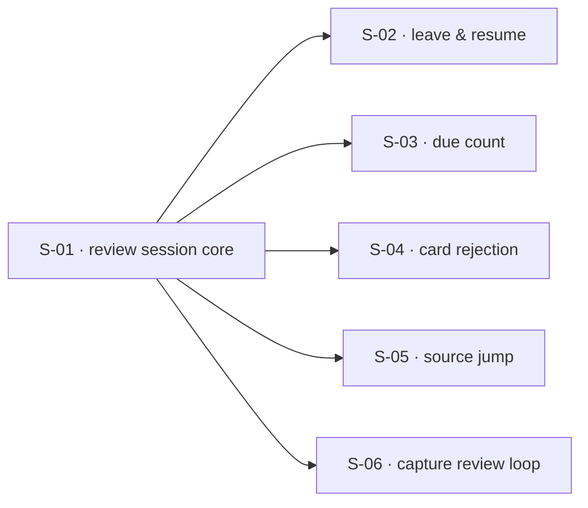

## At a glance

| ID | Outcome | Change ID | Status |
|----|---------|-----------|--------|
| S-01 | Users can work through every due card in one review sitting — graded cards reschedule themselves | remember-flow-review-session | done |
| S-02 | Users can leave a review mid-way and pick up where they left off | remember-flow-session-resume | done |
| S-03 | Users can see how many cards are due without opening a review | remember-flow-due-count | done |
| S-04 | Users can reject a bad card during review so it stops coming back | remember-flow-card-rejection | done |
| S-05 | Users can jump from a card under review to its source passage | remember-flow-source-jump | in_progress |
| S-06 | Users can open a review from within a capture session and return to the conversation with nothing lost | remember-flow-capture-review | done |

## Dependencies

## Slices

### S-01: Users can work through every due card in one review sitting — graded cards reschedule themselves

- **Outcome:** Users can work through every due card in one review sitting — graded cards reschedule themselves
- **Acceptance criteria:** AC-01, AC-02, AC-03, AC-04, AC-05, AC-06, AC-07, AC-08, AC-09
- **Change ID:** remember-flow-review-session
- **Status:** done

### S-02: Users can leave a review mid-way and pick up where they left off

- **Outcome:** Users can leave a review mid-way and pick up where they left off
- **Acceptance criteria:** AC-10, AC-11, AC-12, AC-13
- **Change ID:** remember-flow-session-resume
- **Status:** done
- **Prerequisites:** S-01
- **Parallel with:** S-03, S-04, S-05, S-06

### S-03: Users can see how many cards are due without opening a review

- **Outcome:** Users can see how many cards are due without opening a review
- **Acceptance criteria:** AC-14, AC-15
- **Change ID:** remember-flow-due-count
- **Status:** done
- **Prerequisites:** S-01
- **Parallel with:** S-02, S-04, S-05, S-06

### S-04: Users can reject a bad card during review so it stops coming back

- **Outcome:** Users can reject a bad card during review so it stops coming back
- **Acceptance criteria:** AC-17, AC-23
- **Change ID:** remember-flow-card-rejection
- **Status:** done
- **Prerequisites:** S-01
- **Parallel with:** S-02, S-03, S-05, S-06

### S-05: Users can jump from a card under review to its source passage

- **Outcome:** Users can jump from a card under review to its source passage
- **Acceptance criteria:** AC-18, AC-19, AC-20
- **Change ID:** remember-flow-source-jump
- **Status:** in_progress
- **Prerequisites:** S-01
- **Parallel with:** S-02, S-03, S-04, S-06

### S-06: Users can open a review from within a capture session and return to the conversation with nothing lost

- **Outcome:** Users can open a review from within a capture session and return to the conversation with nothing lost
- **Acceptance criteria:** AC-21, AC-22
- **Change ID:** remember-flow-capture-review
- **Status:** done
- **Prerequisites:** S-01
- **Notes:** Narrowed 2026-09-11 — AC-16 dropped with FR-012 (PRD v2 Non-Goals), which also drops the S-03 prerequisite.
- **Parallel with:** S-02, S-04, S-05

## Done

- **S-01: Users can work through every due card in one review sitting — graded cards reschedule themselves** — Archived 2026-09-10 → `context/archive/changes/2026-09-09-remember-flow-review-session/`. Lesson: —.
- **S-02: Users can leave a review mid-way and pick up where they left off** — Archived 2026-09-10 → `context/archive/changes/2026-09-10-remember-flow-session-resume/`. Lesson: —.
- **S-03: Users can see how many cards are due without opening a review** — Archived 2026-09-11 → `context/archive/changes/2026-09-10-remember-flow-due-count/`. Lesson: —.
- **S-04: Users can reject a bad card during review so it stops coming back** — Archived 2026-09-11 → `context/archive/changes/2026-09-11-remember-flow-card-rejection/`. Lesson: —.
- **S-06: Users can open a review from within a capture session and return to the conversation with nothing lost** — Archived 2026-09-11 → `context/archive/changes/2026-09-11-remember-flow-capture-review/`. Lesson: —.
